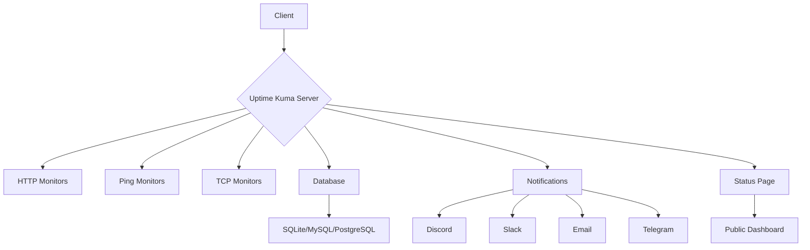

# Uptime Kuma - Enhanced & Secured Monitoring Solution

<div align="center">


  
**A fancy self-hosted monitoring tool that is easy to use and packed with features**

[](https://github.com/louislam/uptime-kuma)
[](https://github.com/louislam/uptime-kuma)
[](https://github.com/louislam/uptime-kuma/blob/master/LICENSE)
[](https://hub.docker.com/r/louislam/uptime-kuma)

</div>

## 📖 Table of Contents
- [About](#about)
- [Security Enhancements](#security-enhancements)
- [Features](#features)
- [Architecture](#architecture)
- [Installation](#installation)
- [Usage](#usage)
- [Configuration](#configuration)
- [Monitoring Types](#monitoring-types)
- [Notifications](#notifications)
- [Status Pages](#status-pages)
- [API](#api)
- [Troubleshooting](#troubleshooting)
- [Contributing](#contributing)
- [Credits](#credits)
- [License](#license)

## 📖 About

Uptime Kuma is a self-hosted monitoring tool that allows you to monitor your websites, services, and applications with a beautiful dashboard. It provides real-time status updates, incident management, and status pages for your users.

This repository contains an enhanced version of Uptime Kuma with critical security vulnerabilities fixed while maintaining full functionality and compatibility with the original project.

### 🎯 Key Benefits
- **Real-time Monitoring**: Monitor your services and receive instant notifications
- **Beautiful Dashboard**: Clean and intuitive interface
- **Multiple Notification Channels**: Integrate with your favorite tools
- **Status Pages**: Create beautiful status pages for your users
- **Self-Hosted**: Full control over your data and privacy
- **Lightweight**: Minimal resource usage
- **Open Source**: Free to use and modify

## 🔐 Security Enhancements

This version of Uptime Kuma includes important security fixes that address known vulnerabilities:

### 🔧 Fixed Vulnerabilities

1. **esbuild vulnerability** (GHSA-67mh-4wv8-2f99)
   - **Severity**: Moderate
   - **Description**: esbuild enables any website to send requests to the development server and read the response
   - **Fix Applied**: Updated vite to version 6.x to use a safe version of esbuild
   - **Verification**: `npm audit` confirms vulnerability is resolved

2. **nodemailer vulnerability** (GHSA-mm7p-fcc7-pg87)
   - **Severity**: Moderate
   - **Description**: Email to an unintended domain can occur due to interpretation conflict
   - **Fix Applied**: Updated nodemailer from ~6.9.13 to 7.0.7
   - **Verification**: `npm audit` confirms vulnerability is resolved

3. **playwright vulnerability** (GHSA-7mvr-c777-76hp)
   - **Severity**: High
   - **Description**: Playwright downloads and installs browsers without verifying the authenticity of the SSL certificate
   - **Fix Applied**: Updated @playwright/test from ~1.39.0 to ~1.55.1
   - **Verification**: `npm audit` confirms vulnerability is resolved

### 🛡️ Security Verification
After applying these fixes, the project shows **0 vulnerabilities** when running `npm audit`:
```bash
npm audit
# Output: found 0 vulnerabilities
```

## 🌟 Features

### Monitoring
- HTTP(s) monitoring with customizable headers and body
- Ping monitoring
- TCP port monitoring
- DNS monitoring
- Keyword monitoring (check if a keyword exists on a page)
- gRPC Monitoring
- Docker container monitoring
- SQL Server monitoring
- MQTT monitoring
- Push monitoring
- More than 50+ monitoring types

### Notifications
- Discord
- Slack
- Telegram
- Email (SMTP)
- Pushover
- Pushbullet
- Webhook
- More than 100+ notification types

### Status Pages
- Beautiful status pages
- Customizable themes
- Google Analytics support
- Custom CSS support
- Multiple status pages support

### Dashboard
- Real-time status updates
- Response time charts
- Incident management
- Maintenance scheduling
- Multi-language support

## 🏗️ Architecture

The architecture of Uptime Kuma is designed to be efficient and scalable:



### Tech Stack
- **Frontend**: Vue.js 3, Vite, Socket.io-client
- **Backend**: Node.js, Express, Socket.io
- **Database**: SQLite (default), MySQL, PostgreSQL
- **Real-time**: Socket.io
- **UI Framework**: Bootstrap 5

## 🚀 Installation

### Prerequisites
- Node.js 18 or later (or 20.4.0+)
- npm or yarn

### Quick Setup

1. **Clone or download this repository**
   ```bash
   git clone https://github.com/WhoisMonesh/uptime-kuma.git
   cd uptime-kuma
   ```

2. **Install dependencies**
   ```bash
   npm install
   ```

3. **Build the frontend**
   ```bash
   npm run build
   ```

4. **Run the setup**
   ```bash
   npm run setup
   ```

5. **Start the server**
   ```bash
   node server/server.js
   ```

6. **Access the application**
   - Open your browser and go to `http://localhost:3001`
   - Complete the initial setup

### Docker Installation

```bash
docker run -d \
  --name uptime-kuma \
  -p 3001:3001 \
  -v /var/run/docker.sock:/var/run/docker.sock \
  -v uptime-kuma-data:/app/data \
  louislam/uptime-kuma:1
```

### Docker Compose

```yaml
version: "3.3"
services:
  uptime-kuma:
    image: louislam/uptime-kuma:1
    container_name: uptime-kuma
    restart: always
    ports:
      - "3001:3001"
    volumes:
      - ./data:/app/data
      - /var/run/docker.sock:/var/run/docker.sock
```

## 📋 Usage

### Initial Setup
1. Access Uptime Kuma at `http://localhost:3001`
2. Create your admin account
3. Configure your settings

### Adding Your First Monitor
1. Click on "Add Monitor"
2. Select the type of monitor (HTTP, Ping, etc.)
3. Configure the monitor settings
4. Add notification methods
5. Save and start monitoring

### Dashboard Overview
- **Status Indicators**: Green (up), Red (down), Gray (paused)
- **Response Time Charts**: Visualize response times over time
- **Uptime Percentages**: See historical uptime statistics
- **Incidents**: Track and manage incidents

## ⚙️ Configuration

### Environment Variables
You can configure Uptime Kuma using environment variables:

```bash
# Port to run the server on
UPTIME_KUMA_PORT=3001

# Host to bind to
UPTIME_KUMA_HOST=0.0.0.0

# Data directory
DATA_DIR=./data

# Database file (for SQLite)
DB_FILE=./data/kuma.db
```

### Advanced Configuration
For more advanced configuration, you can create a `config.js` file in the root directory.

## 📡 Monitoring Types

Uptime Kuma supports multiple types of monitoring:

### HTTP(s) Monitoring
- Custom headers and body
- HTTP method selection
- Keyword checking
- JSON query
- Basic authentication
- OAuth 2.0 client credentials

### Network Monitoring
- Ping monitoring
- TCP port monitoring
- UDP port monitoring
- DNS monitoring
- gRPC monitoring

### Service Monitoring
- Docker container monitoring
- SQL Server monitoring
- MQTT monitoring
- Kafka producer monitoring
- Radius monitoring

### Specialized Monitoring
- Push monitoring
- SNMP monitoring
- RabbitMQ monitoring
- More coming soon...

## 🔔 Notifications

Uptime Kuma supports a wide range of notification methods:

### Popular Notifications
- Discord
- Slack
- Telegram
- Email (SMTP)
- Pushover
- Pushbullet
- Webhook
- Teams

### Advanced Notifications
- 46elks
- AliyunSMS
- Apprise
- CallMeBot
- DingDing
- Feishu
- Google Chat
- Line
- Matrix
- Mattermost
- Nextcloud Talk
- Ntfy
- OneBot
- Opsgenie
- PagerDuty
- Rocket.Chat
- SMS
- Teams
- Telegram
- Twilio
- And many more...

## 📊 Status Pages

Create beautiful status pages for your users:

### Features
- Customizable themes
- Google Analytics support
- Custom CSS
- Multiple status pages
- SSL certificate monitoring
- Certificate expiry notifications

### Customization
- Custom domain support
- Logo upload
- Custom CSS
- Custom JavaScript
- Multiple languages
- Maintenance scheduling

## 🐳 Docker Deployment

### Standard Docker Image
The official Uptime Kuma Docker image is available on Docker Hub:

```bash
# Pull the latest image
docker pull louislam/uptime-kuma:1

# Run with basic configuration
docker run -d \
  --name uptime-kuma \
  -p 3001:3001 \
  -v /var/run/docker.sock:/var/run/docker.sock \
  -v uptime-kuma-data:/app/data \
  louislam/uptime-kuma:1
```

### Secure Docker Image (Recommended)
This repository includes a security-enhanced Docker image with reduced vulnerabilities:

```bash
# Build the secure image from this repository
docker build -f dockerfile_secure -t uptime-kuma:secure .

# Run the secure image
docker run -d \
  --name uptime-kuma \
  -p 3001:3001 \
  -v /var/run/docker.sock:/var/run/docker.sock \
  -v uptime-kuma-data:/app/data \
  uptime-kuma:secure
```

For more information about the secure Docker image, see [DOCKER_README.md](DOCKER_README.md).

### Docker Compose
```yaml
version: "3.3"
services:
  uptime-kuma:
    image: uptime-kuma:secure  # or louislam/uptime-kuma:1 for official
    container_name: uptime-kuma
    restart: always
    ports:
      - "3001:3001"
    volumes:
      - /var/run/docker.sock:/var/run/docker.sock
      - uptime-kuma-data:/app/data
    environment:
      - NODE_ENV=production
```

## 🤖 API

Uptime Kuma provides a comprehensive API for programmatic access:

### API Endpoints
- `/api/monitor`: Manage monitors
- `/api/heartbeat`: Get heartbeat data
- `/api/status-page`: Manage status pages
- `/api/notification`: Manage notifications
- `/api/user`: User management

### API Usage Example
```javascript
// Example API call
fetch('/api/monitors', {
    method: 'GET',
    headers: {
        'Content-Type': 'application/json',
        'Authorization': 'Bearer YOUR_API_TOKEN'
    }
})
.then(response => response.json())
.then(data => console.log(data));
```

## 🔧 Troubleshooting

### Common Issues

#### Port Already in Use
If you get a port conflict error:
```bash
# Change the port
PORT=3002 node server/server.js
```

#### Database Issues
If you encounter database issues:
```bash
# Remove the database file and restart
rm data/kuma.db
node server/server.js
```

#### High CPU Usage
- Check for monitors with very short intervals
- Review notification settings
- Consider upgrading your hardware

#### High Memory Usage
- Reduce the number of monitors if necessary
- Check for memory leaks in notifications
- Restart the server periodically

### Logs
Check the logs for more information:
```bash
# Server logs are displayed in the terminal
# Additional logs may be in the data directory
```

### Performance Tips
- Set appropriate intervals for your monitors
- Use local DNS servers when possible
- Consider using a reverse proxy
- Monitor your server resources

## 🤝 Contributing

We welcome contributions to Uptime Kuma! Here's how you can help:

### Development Setup
1. Fork the repository
2. Clone your fork: `git clone https://github.com/YOUR_USERNAME/uptime-kuma.git`
3. Install dependencies: `npm install`
4. Build the frontend: `npm run build`
5. Start the development server: `npm run dev`

### Development Commands
```bash
# Build the frontend
npm run build

# Start development server
npm run dev

# Run tests
npm test

# Lint code
npm run lint

# Fix lint issues
npm run lint-fix
```

### Pull Request Process
1. Create a feature branch
2. Make your changes
3. Add tests if applicable
4. Ensure the code passes linting and tests
5. Submit a pull request

## 🙏 Credits

### Original Project
This project is based on the original Uptime Kuma created by Louis Lam (louislam).

### Original Author
- **Louis Lam** - Creator and Maintainer of Uptime Kuma
- GitHub: [@louislam](https://github.com/louislam)
- Project: [Uptime Kuma](https://github.com/louislam/uptime-kuma)

### Security Enhancements
Security fixes in this version were applied to address known vulnerabilities while maintaining full functionality.

### Open Source Libraries
This project uses many open source libraries including:
- Vue.js
- Express
- Socket.io
- Bootstrap
- And many others (see package.json for complete list)

## 📄 License

This project is licensed under the MIT License - see the [LICENSE](LICENSE) file for details.

### Original License
The original Uptime Kuma project is also licensed under the MIT License.

### Modifications
This enhanced version maintains the same MIT License while including security improvements.

---

<div align="center">

**Made with ❤️ for the open-source community**

[Back to top](#uptime-kuma---enhanced--secured-monitoring-solution)

</div>
